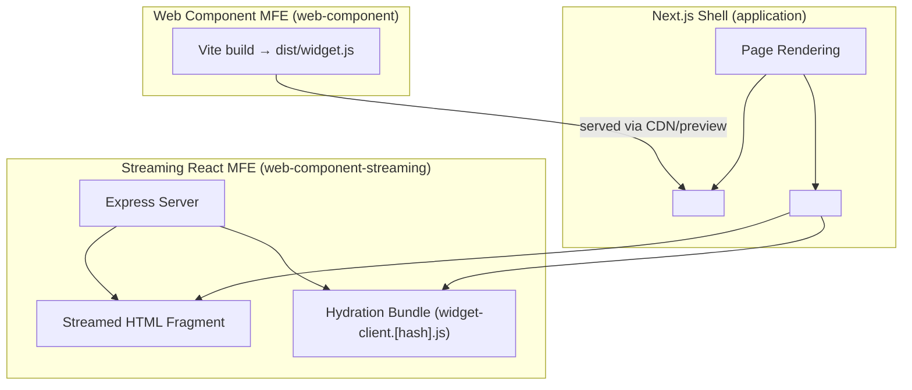

# microfrontend-experiments

This project demonstrates different approaches to building **microfrontends** and integrating them into a **Next.js shell application**.

We explore two styles of shareable widgets:

1. **Web Component approach** (standalone, framework-agnostic)
2. **Streaming React widget approach** (SSR + hydration from a widget server)

---

## 🗺️ Architecture Diagram



## 📂 Project Structure

├── application # Next.js shell (host app)
│ └── app/... # Uses microfrontends
│
├── web-component # Microfrontend built as a Web Component
│ └── src/... # Custom element definition, Vite build
│ └── dist/... # Outputs single JS bundle for CDN/embedding
│
├── web-component-streaming # React widget with Express server (SSR streaming)
│ └── src/... # Widget React components + hydration
│ └── dist/... # Vite output (client bundle + manifest.json)
│ └── server.js # Express server streaming HTML + injecting scripts

---

## 🧩 Approaches

### 1. Web Component MFE

- **Built with Vite** into a single bundle (UMD/ESM).
- Exports a **Custom Element** (e.g. `<my-widget></my-widget>`).
- Can be embedded in any host app (Next.js, plain HTML, Angular, Vue, etc).
- Next.js shell loads it via `<script src=".../widget.js"></script>`.
- ✅ Portable, framework-agnostic
- ❌ No SSR, no streaming

---

### 2. Streaming React Widget MFE

- A standalone **Express server** serves:
  - **HTML fragment** generated via React SSR (streamed to the shell).
  - **Hydration script** built with Vite (`dist/manifest.json` ensures cache-busting).
- Next.js shell fetches the fragment at runtime and **inlines it with `dangerouslySetInnerHTML`**.
- Widget hydrates in the browser, so **state and event handlers work**.
- ✅ Supports SSR + progressive streaming → faster perceived load
- ✅ Independent deploy + automatic cache-busting (hashed bundles)
- ❌ Tighter coupling (requires React runtime)

---

## 🚀 Getting Started

### 1. Install dependencies

From repo root:

```bash
npm install
```

(or pnpm install / yarn install)

### 2. Start the Web Component MFE

```bash
cd web-component
npm run build # creates dist/widget.js

# serve dist/widget.js via CDN or dev server
npm run preview
```

This produces a single JS file that defines your <my-widget> custom element.

### 3. Start the Streaming React Widget server

```bash
cd web-component-streaming
npm run build    # Vite client bundle (dist + manifest.json)
npm run dev      # Start Express server on :8000
```

### 4. Start the Next Shell

```bash
cd application
npm run dev
```

- Runs on http://localhost:3000.

- Integrates both types of widgets:

  - Loads <my-widget> from the Web Component build.

  - Streams and hydrates React widget(s) from the Streaming server(s).

# Summary

**Caching**:

- Streaming widget client bundle is cache-busted by its hashed filename in `manifest.json`.
- Web Component bundle can also be versioned (`widget.v123.js`).

**CORS**:

- Streaming widget server must allow requests from the shell origin (`http://localhost:3000`).

**Scaling**:

- Multiple streaming widget servers can run independently (`:8000`, `:8001`, …).
- The shell can render them in parallel (via `<Suspense>` for progressive streaming).
